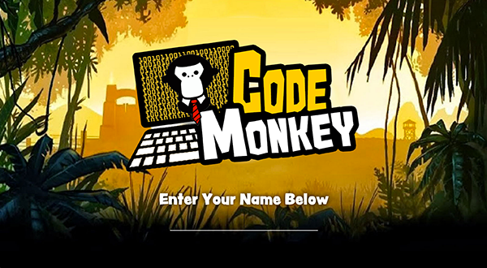
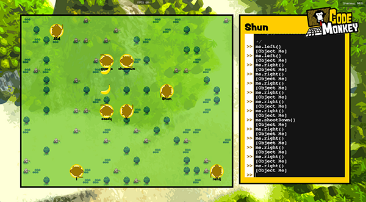

Code Monkey
===========

Code Monkey is a web game that teaches people how to code in an interactive and engaging way. What is special about Code Monkey is that it can be a way for friends to demonstrate mutual prowess of coding skill through a more lighthearted manner of fighting it out with monkeys. 

The decision to put it multiplayer was made with the idea that real players evolve real strategies for playing the game (such as writing macros to queue attacks and attack afterwards).

One of the core mechanics that is interesting is a dilemma on whether to invest in writing macros for the future, or writing functions that work right at the moment. The player can only do one of these things at a time, and both of these involve oppurtunity costs.

This hack won the 3rd place at [Facebook Singapore Hackathon](https://www.facebook.com/events/574877579268704/).

Installation Instructions
-----------------------

1. Install node.js (if not already on system)
2. Install package dependencies

        $ npm install

3. Run the web server

        $ node app.js

4. Navigate to [http://localhost:8080/](http://localhost:8080/) in a modern browser.

Contributors
------------
Soon Chun Mun ([@chunmun](https://github.com/chunmun))
Joe Chee ([@joechee](https://github.com/codemonkey))
Soedarsono ([@soedar](https://github.com/soedar))
Tay Yang Shun ([@yangshun](https://github.com/yangshun))
